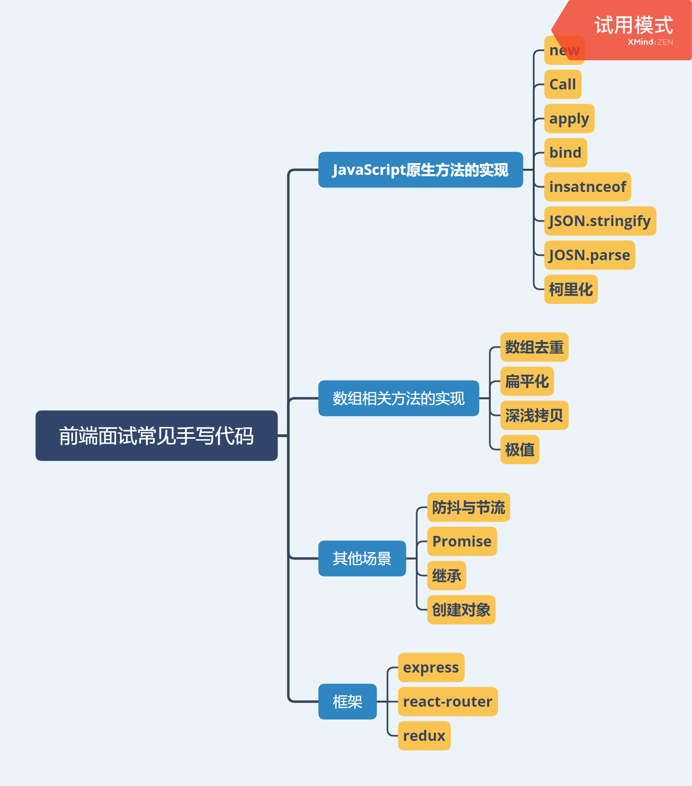

# javascript-code-segment


本系列会从面试的角度出发围绕JavaScript，Node.js(npm包)以及框架三个方面来对常见的模拟实现进行总结，具体源代码放在github项目上，长期更新和维护

# 数组去重

（一维)数组去重最原始的方法就是使用双层循环，分别循环原始数组和新建数组；或者我们可以使用`indexOf`来简化内层的循环；或者可以将原始数组排序完再来去重，这样会减少一个循环，只需要比较前后两个数即可；当然我们可以使用`ES5`,`ES6`的方法来简化去重的写法，比如我们可以使用`filter`来简化内层循环，或者使用`Set`、`Map`、扩展运算符这些用起来更简单的方法，但是效率上应该不会比原始方法好。二维数组的去重可以在上面方法的基础上再判断元素是不是数组，如果是的话，就进行递归处理。

### 双层循环

```javascript
var array = [1, 1, '1', '1'];

function unique(array) {
    var res = [];
    for (var i = 0, arrayLen = array.length; i < arrayLen; i++) {
        for (var j = 0, resLen = res.length; j < resLen; j++ ) {
            if (array[i] === res[j]) {
                break;
            }
        }
        if (j === resLen) {
            res.push(array[i])
        }
    }
    return res;
}

console.log(unique(array)); // [1, "1"]
```

### 利用indexOf

```javascript
var array = [1, 1, '1'];

function unique(array) {
    var res = [];
    for (var i = 0, len = array.length; i < len; i++) {
        var current = array[i];
        if (res.indexOf(current) === -1) {
            res.push(current)
        }
    }
    return res;
}

console.log(unique(array));
```

### 排序后去重

```javascript
var array = [1, 1, '1'];

function unique(array) {
    var res = [];
    var sortedArray = array.concat().sort();
    var seen;
    for (var i = 0, len = sortedArray.length; i < len; i++) {
        // 如果是第一个元素或者相邻的元素不相同
        if (!i || seen !== sortedArray[i]) {
            res.push(sortedArray[i])
        }
        seen = sortedArray[i];
    }
    return res;
}

console.log(unique(array));
```

### filter

`filter`可以用来简化外层循环

**使用indexOf：**

```javascript
var array = [1, 2, 1, 1, '1'];

function unique(array) {
    var res = array.filter(function(item, index, array){
        return array.indexOf(item) === index;
    })
    return res;
}

console.log(unique(array));
```

**排序去重：**

```javascript
var array = [1, 2, 1, 1, '1'];

function unique(array) {
    return array.concat().sort().filter(function(item, index, array){
        return !index || item !== array[index - 1]
    })
}

console.log(unique(array));
```

### ES6方法

**Set：**

```javascript
var array = [1, 2, 1, 1, '1'];

function unique(array) {
   return Array.from(new Set(array));
}

console.log(unique(array)); // [1, 2, "1"]
```

再简化下

```javascript
function unique(array) {
    return [...new Set(array)];
}

//或者
var unique = (a) => [...new Set(a)]
```

**Map：**

```javascript
function unique (arr) {
    const seen = new Map()
    return arr.filter((a) => !seen.has(a) && seen.set(a, 1))
}
```

# 类型判断

类型判断需要注意以下几点

- `typeof`对六个基本数据类型`Undefined`、`Null`、`Boolean`、`Number`、`String`、`Object`（大写）返回的结果是

  `undefined`、`object`、`boolean`、`number`、`string`、`object`（小写），可以看到`Null`和`Object` 类型都返回了 `object` 字符串；`typeof`却能检测出函数类型；**综上，`typeof`能检测出六种类型，但是不能检测出`null`类型和`Object`下细分的类型，如`Array`，`Function`，`Date`，`RegExp`,`Error`等**。

- `Object.prototype.toString`的作用非常强大，它能检测出基本数据类型以及`Object`下的细分类型，甚至像
  `Math`,`JSON`,`arguments`它都能检测出它们的具体类型，它返回结果形式例如`[object Number] `(注意最后的数据类型是大写).**所以，`Object.prototype.toString`基本上能检测出所有的类型了，只不过有时需要考虑到兼容性低版本浏览器的问题。**

### 通用API

```javascript
    
// 该类型判断函数可以判断六种基本数据类型以及Boolean Number String Function Array Date RegExp Object Error，
// 其他类型因为遇到类型判断的情况较少所以都会返回object,不在进行详细的判断
//  比如ES6新增的Symbol，Map，Set等类型
var classtype = {};


"Boolean Number String Function Array Date RegExp Object Error".split(" ").map(function(item) {
    classtype["[object " + item + "]"] = item.toLowerCase();
})


function type(obj) {
    // 解决IE6中null和undefined会被Object.prototype.toString识别成[object Object]
    if (obj == null) {
        return obj + "";
    }

    //如果是typeof后类型为object下的细分类型(Array,Function,Date,RegExp,Error)或者是Object类型，则要利用Object.prototype.toString
    //由于ES6新增的Symbol，Map，Set等类型不在classtype列表中，所以使用type函数，返回的结果会是object
    return typeof obj === "object" || typeof obj === "function" ?
        classtype[Object.prototype.toString.call(obj)] || "object" :
        typeof obj;
}
```

### 判断空对象

判断是否有属性，`for`循环一旦执行，就说明有属性，此时返回`false`

```javascript
function isEmptyObject( obj ) {
        var name;
        for ( name in obj ) {
            return false;
        }
        return true;
}

console.log(isEmptyObject({})); // true
console.log(isEmptyObject([])); // true
console.log(isEmptyObject(null)); // true
console.log(isEmptyObject(undefined)); // true
console.log(isEmptyObject(1)); // true
console.log(isEmptyObject('')); // true
console.log(isEmptyObject(true)); // true
```

我们可以看出`isEmptyObject`实际上判断的并不仅仅是空对象。但是既然` jQuery `是这样写，可能是因为考虑到实际开发中 `isEmptyObject `用来判断 {} 和 {a: 1} 是足够的吧。如果真的是只判断 {}，完全可以结合上篇写的 `type `函数筛选掉不适合的情况。

### 判断Window对象

`Window`对象有一个`window`属性指向自身，可以利用这个特性来判断是否是`Window`对象

```javascript
function isWindow( obj ) {
    return obj != null && obj === obj.window;
}
```

### 判断数组

`isArray`是数组类型内置的数据类型判断函数，但是会有兼容性问题，一个`polyfill`如下

```javascript
isArray = Array.isArray || function(array){
  return Object.prototype.toString.call(array) === '[object Array]';
}
```

### 判断类数组

`jquery`实现的`isArrayLike`,数组和类数组都会返回`true`。所如果` isArrayLike `返回`true`，至少要满足三个条件之一：

1. 是数组

2. 长度为 0
   比如下面情况,如果我们去掉length === 0 这个判断，就会打印 `false`，然而我们都知道 `arguments` 是一个类数组对象，这里是应该返回 `true` 的

   ```javascript
   function a(){
       console.log(isArrayLike(arguments))
   }
   a();
   ```

3. `lengths` 属性是大于 0 的数字类型，并且`obj[length - 1]`必须存在(考虑到arr = [,,3]的情况)

```javascript
function isArrayLike(obj) {

    // obj 必须有 length属性
    var length = !!obj && "length" in obj && obj.length;
    var typeRes = type(obj);

    // 排除掉函数和 Window 对象
    if (typeRes === "function" || isWindow(obj)) {
        return false;
    }

    return typeRes === "array" || length === 0 ||
        typeof length === "number" && length > 0 && (length - 1) in obj;
}
```

### 判断NaN

判断一个数是不是` NaN `不能单纯地使用 === 这样来判断, 因为` NaN `不与任何数相等, 包括自身,注意在`ES6`的`isNaN`中只有值为数字类型使用`NaN`才会返回`true`

```javascript
isNaN: function(value){
  return isNumber(value) && isNaN(value);
}
```

### 判断DOM元素

利用`DOM`对象特有的`nodeType`属性（

```javascript
isElement: function(obj){
  return !!(obj && obj.nodeType === 1);
    // 两次感叹号将值转化为布尔值
}
```

### 判断arguments对象

低版本的浏览器中`argument`对象通过`Object.prototype.toString`判断后返回的是`[object Object]`,所以需要兼容

```javascript
isArguments: function(obj){
  return Object.prototype.toString.call(obj) === '[object Arguments]' || (obj != null && Object.hasOwnProperty.call(obj, 'callee'));
}
```

# 深浅拷贝

如果是数组，实现浅拷贝，比可以`slice`，`concat`返回一个新数组的特性来实现；实现深拷贝，可以利用`JSON.parse`和`JSON.stringify`来实现，但是有一个问题，不能拷贝函数（此时拷贝后返回的数组为`null`）。上面的方法都属于技巧，下面考虑怎么实现一个对象或者数组的深浅拷贝

### 浅拷贝

思路很简单，遍历对象，然后把属性和属性值都放在一个新的对象就OK了

```javascript
var shallowCopy = function(obj) {
    // 只拷贝对象
    if (typeof obj !== 'object') return;
    // 根据obj的类型判断是新建一个数组还是对象
    var newObj = obj instanceof Array ? [] : {};
    // 遍历obj，并且判断是obj的属性才拷贝
    for (var key in obj) {
        if (obj.hasOwnProperty(key)) {
            newObj[key] = obj[key];
        }
    }
    return newObj;
}
```

### 深拷贝

思路也很简单，就是在拷贝的时候判断一下属性值的类型，如果是对象，就递归调用深浅拷贝函数就ok了

```javascript
var deepCopy = function(obj) {
    if (typeof obj !== 'object') return;
    var newObj = obj instanceof Array ? [] : {};
    for (var key in obj) {
        if (obj.hasOwnProperty(key)) {
            newObj[key] = typeof obj[key] === 'object' ? deepCopy(obj[key]) : obj[key];
        }
    }
    return newObj;
}
```

# 扁平化

### 递归

循环数组元素，如果还是一个数组，就递归调用该方法

```javascript
// 方法 1
var arr = [1, [2, [3, 4]]];

function flatten(arr) {
    var result = [];
    for (var i = 0, len = arr.length; i < len; i++) {
        if (Array.isArray(arr[i])) {
            result = result.concat(flatten(arr[i]))
        }
        else {
            result.push(arr[i])
        }
    }
    return result;
}


console.log(flatten(arr))
```

### toString()

如果数组的元素都是数字，可以使用该方法

```javascript
// 方法2
var arr = [1, [2, [3, 4]]];

function flatten(arr) {
    return arr.toString().split(',').map(function(item){
        return +item // +会使字符串发生类型转换
    })
}

console.log(flatten(arr))
```

### reduce()

```javascript
// 方法3
var arr = [1, [2, [3, 4]]];

function flatten(arr) {
    return arr.reduce(function(prev, next){
        return prev.concat(Array.isArray(next) ? flatten(next) : next)
    }, [])
}

console.log(flatten(arr))
```

### ...

```javascript
// 扁平化一维数组
var arr = [1, [2, [3, 4]]];
console.log([].concat(...arr)); // [1, 2, [3, 4]]

// 可以扁平化多维数组
var arr = [1, [2, [3, 4]]];

function flatten(arr) {

    while (arr.some(item => Array.isArray(item))) {
        arr = [].concat(...arr);
    }

    return arr;
}

console.log(flatten(arr))
```

# 柯里化

### 通用版

```javascript
function curry(fn, args) {
    var length = fn.length;
    var args = args || [];
    return function(){
        newArgs = args.concat(Array.prototype.slice.call(arguments));
        if (newArgs.length < length) {
            return curry.call(this,fn,newArgs);
        }else{
            return fn.apply(this,newArgs);
        }
    }
}

function multiFn(a, b, c) {
    return a * b * c;
}

var multi = curry(multiFn);

multi(2)(3)(4);
multi(2,3,4);
multi(2)(3,4);
multi(2,3)(4);

```

### ES6版

```javascript
const curry = (fn, arr = []) => (...args) => (
  arg => arg.length === fn.length
    ? fn(...arg)
    : curry(fn, arg)
)([...arr, ...args])

let curryTest=curry((a,b,c,d)=>a+b+c+d)
curryTest(1,2,3)(4) //返回10
curryTest(1,2)(4)(3) //返回10
curryTest(1,2)(3,4) //返回10
```

# 防抖与节流

### 防抖

```javascript
function debounce(fn, wait) {
    var timeout = null;
    return function() {
        if(timeout !== null) 
        {
                clearTimeout(timeout);
        }
        timeout = setTimeout(fn, wait);
    }
}
// 处理函数
function handle() {
    console.log(Math.random()); 
}
// 滚动事件
window.addEventListener('scroll', debounce(handle, 1000));
```

### 节流

#### 利用时间戳实现

```javascript
   var throttle = function(func, delay) {
            var prev = Date.now();
            return function() {
                var context = this;
                var args = arguments;
                var now = Date.now();
                if (now - prev >= delay) {
                    func.apply(context, args);
                    prev = Date.now();
                }
            }
        }
        function handle() {
            console.log(Math.random());
        }
        window.addEventListener('scroll', throttle(handle, 1000));
```

#### 利用定时器实现

```javascript
   var throttle = function(func, delay) {
            var timer = null;
            return function() {
                var context = this;
                var args = arguments;
                if (!timer) {
                    timer = setTimeout(function() {
                        func.apply(context, args);
                        timer = null;
                    }, delay);
                }
            }
        }
        function handle() {
            console.log(Math.random());
        }
        window.addEventListener('scroll', throttle(handle, 1000));
```

# 模拟new

- `new`产生的实例可以访问`Constructor`里的属性，也可以访问到`Constructor.prototype`中的属性，前者可以通过`apply`来实现，后者可以通过将实例的`proto`属性指向构造函数的`prototype`来实现
- 我们还需要判断返回的值是不是一个对象，如果是一个对象，我们就返回这个对象，如果没有，我们该返回什么就返回什么

```javascript
function New(){
    var obj=new Object();
    //取出第一个参数，就是我们要传入的构造函数；此外因为shift会修改原数组，所以arguments会被去除第一个参数
    Constructor=[].shift.call(arguments);
    //将obj的原型指向构造函数，这样obj就可以访问到构造函数原型中的属性
    obj._proto_=Constructor.prototype;
    //使用apply改变构造函数this的指向到新建的对象，这样obj就可以访问到构造函数中的属性
    var ret=Constructor.apply(obj,arguments);
    //要返回obj
    return typeof ret === 'object' ? ret:obj;
}
```

```javascript
function Otaku(name,age){
	this.name=name;
	this.age=age;
	this.habit='Games'
}

Otaku.prototype.sayYourName=function(){
    console.log("I am" + this.name);
}

var person=objectFactory(Otaku,'Kevin','18')

console.log(person.name)//Kevin
console.log(person.habit)//Games
console.log(person.strength)//60
```

# 模拟call

- `call()`方法在使用一个指定的this值和若干个指定的参数值的前提下调用某个函数或方法
- 模拟的步骤是：将函数设为对象的属性—>执行该函数—>删除该函数
- `this`参数可以传`null`，当为`null`的时候，视为指向`window`
- 函数是可以有返回值的

### 简单版

```javascript
var foo = {
    value: 1,
    bar: function() {
        console.log(this.value)
    }
}
foo.bar() // 1
```

### 完善版

```javascript
Function.prototype.call2 = function(context) {
    var context=context||window
    context.fn = this;
    let args = [...arguments].slice(1);
    let result = context.fn(...args);
    delete context.fn;
    return result;
}
let foo = {
    value: 1
}
function bar(name, age) {
    console.log(name)
    console.log(age)
    console.log(this.value);
}
//表示bar函数的执行环境是foo，即bar函数里面的this代表foo,this.value相当于foo.value,然后给bar函数传递两个参数
bar.call2(foo, 'black', '18') // black 18 1
```

# 模拟apply

- `apply()`的实现和`call()`类似，只是参数形式不同

```javascript
Function.prototype.apply2 = function(context = window) {
    context.fn = this
    let result;
    // 判断是否有第二个参数
    if(arguments[1]) {
        result = context.fn(...arguments[1])
    } else {
        result = context.fn()
    }
    delete context.fn
    return result
}
```

# 模拟bind

```javascript
Function.prototype.bind2=function(context){
    var self=thisl
    var args=Array.prototype.slice.call(arguments,1);
    
    var fNOP=function(){};
    var fBound=function(){
        var bindArgs=Array.prototype.slice.call(arguments);
        return self.apply(this instanceof fNOP ? this : context, args.concat(bindAt))
    }
}
```

# 模拟instanceof

```javascript
function instanceOf(left,right) {

    let proto = left.__proto__;
    let prototype = right.prototype
    while(true) {
        if(proto === null) return false
        if(proto === prototype) return true
        proto = proto.__proto__;
    }
}
```

# 模拟JSON.stringify

> JSON.stringify(value[, replacer [, space]])

- `Boolean | Number| String` 类型会自动转换成对应的原始值。
- `undefined`、任意函数以及`symbol`，会被忽略（出现在非数组对象的属性值中时），或者被转换成 `null`（出现在数组中时）。
- 不可枚举的属性会被忽略
- 如果一个对象的属性值通过某种间接的方式指回该对象本身，即循环引用，属性也会被忽略。

```javascript
function jsonStringify(obj) {
    let type = typeof obj;
    if (type !== "object") {
        if (/string|undefined|function/.test(type)) {
            obj = '"' + obj + '"';
        }
        return String(obj);
    } else {
        let json = []
        let arr = Array.isArray(obj)
        for (let k in obj) {
            let v = obj[k];
            let type = typeof v;
            if (/string|undefined|function/.test(type)) {
                v = '"' + v + '"';
            } else if (type === "object") {
                v = jsonStringify(v);
            }
            json.push((arr ? "" : '"' + k + '":') + String(v));
        }
        return (arr ? "[" : "{") + String(json) + (arr ? "]" : "}")
    }
}
jsonStringify({x : 5}) // "{"x":5}"
jsonStringify([1, "false", false]) // "[1,"false",false]"
jsonStringify({b: undefined}) // "{"b":"undefined"}"
```

# 模拟JSON.parse

> JSON.parse(text[, reviver])

用来解析JSON字符串，构造由字符串描述的JavaScript值或对象。提供可选的reviver函数用以在返回之前对所得到的对象执行变换(操作)。

### 利用eval

```javascript
function jsonParse(opt) {
    return eval('(' + opt + ')');
}
jsonParse(jsonStringify({x : 5}))
// Object { x: 5}
jsonParse(jsonStringify([1, "false", false]))
// [1, "false", falsr]
jsonParse(jsonStringify({b: undefined}))
// Object { b: "undefined"}
```

> 避免在不必要的情况下使用 `eval`，eval() 是一个危险的函数， 他执行的代码拥有着执行者的权利。如果你用 eval()运行的字符串代码被恶意方（不怀好意的人）操控修改，您最终可能会在您的网页/扩展程序的权限下，在用户计算机上运行恶意代码

### 利用new Function()

`Function`与`eval`有相同的字符串参数特性,`eval` 与 `Function` 都有着动态编译js代码的作用，但是在实际的编程中并不推荐使用。

> var func = new Function(arg1, arg2, ..., functionBody)

```javascript
var jsonStr = '{ "age": 20, "name": "jack" }'
var json = (new Function('return ' + jsonStr))();
```

# 创建对象

创建自定义对象最简单的方式就是创建一个`Object`的实例，然后再为它添加属性和方法，早期的开发人员经常使用这种模式来创建对象，后来对象字面量的方法成了创建对象的首选模式。虽然`object构造函数`或者`对象字面量`的方法都可以用来创建对象，但是这些方法使用同一个接口创建很多对象，会产生大量的重复代码。为了解决这个问题，人们开始使用各种模式来创建对象，在这些模式中，一般推荐使用四种方式，包括`构造函数模式`、`原型模式`、`构造函数和原型组合模式`，`动态原型模式`，其他的方式，包括`工厂模式`、`寄生构造函数模式`、`稳妥构造函数模式`平时使用的较少。而这些方式中，用的最多最推荐的应是**组合模式和动态原型模式**

### 构造函数和原型组合模式

**优点：**

1. 解决了原型模式对于引用对象的缺点
2. 解决了原型模式没有办法传递参数的缺点
3. 解决了构造函数模式不能共享方法的缺点

```javascript
function Person(name) {
  this.name = name
  this.friends = ['lilei']
}
Person.prototype.say = function() {
  console.log(this.name)
}

var person1 = new Person('hanmeimei')
person1.say() //hanmeimei
```

### 动态原型模式

**优点：**

1. 可以在初次调用构造函数的时候就完成原型对象的修改
2. 修改能体现在所有的实例中

```javascript
function Person(name) {
  this.name = name
    // 检测say 是不是一个函数
    // 实际上只在当前第一次时候没有创建的时候在原型上添加sayName方法
    //因为构造函数执行时，里面的代码都会执行一遍，而原型有一个就行，不用每次都重复，所以仅在第一执行时生成一个原型，后面执行就不必在生成，所以就不会执行if包裹的函数，
//其次为什么不能再使用字面量的写法，我们都知道，使用构造函数其实是把new出来的对象作用域绑定在构造函数上，而字面量的写法，会重新生成一个新对象，就切断了两者的联系！
  if(typeof this.say != 'function') {
    Person.prototype.say = function(
    alert(this.name)
  }
}
```
# 继承

`原型链继承`不仅会带来引用缺陷，而且我们也无法为不同的实例初始化继承来的属性；`构造函数继承`方式可以避免类式继承的缺陷，但是我们无法获取到父类的共有方法，也就是通过原型prototype绑定的方法；`组合继承`解决了上面两种方式的存在的问题，但是它调用了两次父类的构造函数；`寄生组合式继承`强化的部分就是在组合继承的基础上减少一次多余的调用父类的构造函数。**推荐使用组合继承方式、寄生组合方式和ES6 extends继承，建议在实际生产中直接使用ES6的继承方式。**

### 组合继承

```javascript
// 声明父类   
function Animal(color) {    
  this.name = 'animal';    
  this.type = ['pig','cat'];    
  this.color = color;   
}     

// 添加共有方法  
Animal.prototype.greet = function(sound) {    
  console.log(sound);   
}     

// 声明子类   
function Dog(color) { 
  // 构造函数继承    
  Animal.apply(this, arguments);   
}   

// 类式继承
Dog.prototype = new Animal();   

var dog = new Dog('白色');   
var dog2 = new Dog('黑色');     

dog.type.push('dog');   
console.log(dog.color); // "白色"
console.log(dog.type);  // ["pig", "cat", "dog"]

console.log(dog2.type); // ["pig", "cat"]
console.log(dog2.color);  // "黑色"
dog.greet('汪汪');  // "汪汪"
```

注：组合继承利用上面的方式会使得两次调用父类构造函数，其实我们可以通过Dog.prototype = Animal.prototype; Dog.prototype.constructor = Dog来优化组合继承，当然终极优化方式就是下面的寄生组合方式。想要了解组合继承具体优化的可以参考 [深入理解JavaScript原型链与继承](https://juejin.im/post/5c08ba1ff265da612577e862)

### 寄生组合继承

```javascript
function Animal(color) {
  this.color = color;
  this.name = 'animal';
  this.type = ['pig', 'cat'];
}

Animal.prototype.greet = function(sound) {
  console.log(sound);
}


function Dog(color) {
  Animal.apply(this, arguments);
  this.name = 'dog';
}
/* 注意下面两行 */
Dog.prototype = Object.create(Animal.prototype);
Dog.prototype.constructor = Dog;

Dog.prototype.getName = function() {
  console.log(this.name);
}


var dog = new Dog('白色');   
var dog2 = new Dog('黑色');     

dog.type.push('dog');   
console.log(dog.color);   // "白色"
console.log(dog.type);   // ["pig", "cat", "dog"]

console.log(dog2.type);  // ["pig", "cat"]
console.log(dog2.color);  // "黑色"
dog.greet('汪汪');  //  "汪汪"
```

Object.create()的浅拷贝的作用类式下面的函数：

```javascript
function create(obj) {
  function F() {};
  F.prototype = obj;
  return new F();
}
```

需注意一点，由于对Animal的原型进行了拷贝后赋给Dog.prototype，因此Dog.prototype上的`constructor`属性也被重写了，所以我们要修复这一个问题：

```javascript
Dog.prototype.constructor = Dog;
```

### extends继承

```javascript
class Animal {   
  constructor(color) {   
    this.color = color;   
  }   
  greet(sound) {   
    console.log(sound);   
  }  
}   

class Dog extends Animal {   
  constructor(color) {   
    super(color);   
    this.color = color;   
  }  
}   

let dog = new Dog('黑色');  
dog.greet('汪汪');  // "汪汪"
console.log(dog.color); // "黑色"
```

# 模拟ajax

- `ajax`请求过程：创建`XMLHttpRequest`对象、连接服务器、发送请求、接收响应数据
- 创建后的`XMLHttpRequest`对象实例拥有很多方法和属性
  - `open`方法类似于初始化，并不会发起真正的请求；`send`方发送请求，并接受一个可选参数
  - 当请求方式为`post`时，可以将请求体的参数传入；当请求方式为`get`时，可以不传或传入`null`;
  - 不管是`get`和`post`，参数都需要通过`encodeURIComponent`编码后拼接

### 通用版

```javascript
//对请求data进行格式化处理
function formateData(data) {
    let arr = [];
    for (let key in data) {
        //避免有&,=,?字符，对这些字符进行序列化
        arr.push(encodeURIComponent(key) + '=' + data[key])
    }
    return arr.join('&');
}

function ajax(params) {
    //先对params进行处理，防止为空
    params = params || {};
    params.data = params.data || {};

    //普通GET,POST请求
    params.type = (params.type || 'GET').toUpperCase();
    params.data = formateData(params.data);
    //如果是在ie6浏览器，那么XMLHttoRequest是不存在的，应该调用ActiveXObject；
    let xhr = XMLHttpRequest ? new XMLHttpRequest() : new ActiveXObject('Microsoft.XMLHTTP');
    if (params.type === 'GET') {
        xhr.open(params.type, params.url + '?' + params.data, true);
        xhr.send();
    } else {
        xhr.open(params.type, params.url, true);
        xhr.setRequestHeader("Content-type", "application/x-www-form-urlencoded")
        xhr.send(params.data);
    }
    // 这里有两种写法，第一种写法：当xhr.readyState===4的时候，会触发onload事件，直接通过onload事件 进行回调函数处理
    xhr.onload = function () {
        if (xhr.status === 200 || xhr.status === 304 || xhr.status === 206) {
            var res;

            if (params.success && params.success instanceof Function) {
                res = JSON.parse(xhr.responseText);
                params.success.call(xhr, res);
            }
        } else {
            if (params.error && params.error instanceof Function) {
                res = xhr.responseText;
                params.error.call(xhr, res);
            }
        }

    }
    //第二种写法，当xhr.readyState===4时候，说明请求成功返回了，进行成功回调
    xhr.onreadystatechange = function () {
        if (xhr.readyState === 4) {
            // 进行onload里面的处理函数
        }
    }

}
```

### promise版

```javascript
// 使用promise实现一个简单的ajax

/**
 * 首先，可能会使用到的xhr方法或者说属性
 * onloadstart // 开始发送时触发
 * onloadend   // 发送结束时触发，无论成功不成功
 * onload      // 得到响应
 * onprogress  // 从服务器上下载数据，每50ms触发一次
 * onuploadprogress // 上传到服务器的回调
 * onerror     // 请求错误时触发
 * onabort     // 调用abort时候触发
 * status      // 返回状态码
 * setRequestHeader // 设置请求头
 * responseType // 请求传入的数据
 */

// 默认的ajax参数
let ajaxDefaultOptions = {
  url: '#', // 请求地址，默认为空
  method: 'GET', // 请求方式，默认为GET请求
  async: true, // 请求同步还是异步，默认异步
  timeout: 0, // 请求的超时时间
  dataType: 'text', // 请求的数据格式，默认为text
  data: null, // 请求的参数，默认为空
  headers: {}, // 请求头，默认为空
  onprogress: function () {}, // 从服务器下载数据的回调
  onuploadprogress: function () {}, // 处理上传文件到服务器的回调
  xhr: null // 允许函数外部创建xhr传入，但是必须不能是使用过的
};

function _ajax(paramOptions) {
  let options = {};
  for (const key in ajaxDefaultOptions) {
    options[key] = ajaxDefaultOptions[key];
  }
  // 如果传入的是否异步与默认值相同，就使用默认值，否则使用传入的参数
  options.async = paramOptions.async === ajaxDefaultOptions.async ? ajaxDefaultOptions.async : paramOptions.async;
  // 判断传入的method是否为GET或者POST,否则传入GET 或者可将判断写在promise内部，reject出去
  options.method = paramOptions.method ? ("GET" || "POST") : "GET";
  // 如果外部传入xhr，否则创建一个
  let xhr = options.xhr || new XMLHttpRequest();
  // return promise对象
  return new Promise(function (resolve, reject) {
    xhr.open(options.method, options.url, options.async);
    xhr.timeout = options.timeout;
    // 设置请求头
    for (const key in options.headers) {
      xhr.setRequestHeader(key, options.headers[key]);
    }
    // 注册xhr对象事件
    xhr.responseType = options.dataType;
    xhr.onprogress = options.onprogress;
    xhr.onuploadprogress = options.onuploadprogress;
    // 开始注册事件
    // 请求成功
    xhr.onloadend = function () {
      if ((xhr.status >= 200 && xhr.status < 300) || xhr.status === 304) {
        resolve(xhr);
      } else {
        reject({
          errorType: "status_error",
          xhr: xhr
        });
      }
    };
    // 请求超时
    xhr.ontimeout = function () {
      reject({
        errorType: "timeout_error",
        xhr: xhr
      });
    }
    // 请求错误
    xhr.onerror = function () {
      reject({
        errorType: "onerror",
        xhr: xhr
      });
    }
    // abort错误(未明白，只知道是三种异常中的一种)
    xhr.onabort = function () {
      reject({
        errorType: "onabort",
        xhr: xhr
      });
    }
    // 捕获异常
    try {
      xhr.send(options.data);
    } catch (error) {
      reject({
        errorType: "send_error",
        error: error
      });
    }
  });
}


// 调用示例
_ajax({
  url: 'http://localhost:3000/suc',
  async: true,
  onprogress: function (evt) {
    console.log(evt.position / evt.total);
  },
  dataType: 'text/json'
}).then(
  function (xhr) {
    console.log(xhr.response);
  },
  function (e) {
    console.log(JSON.stringify(e))
  });
```

# 模拟jsonp
```
// foo 函数将会被调用 传入后台返回的数据
function foo(data) {
    console.log('通过jsonp获取后台数据:', data);
    document.getElementById('data').innerHTML = data;
}
/**
 * 通过手动创建一个 script 标签发送一个 get 请求
 * 并利用浏览器对 <script> 不进行跨域限制的特性绕过跨域问题
 */
(function jsonp() {
    let head = document.getElementsByTagName('head')[0]; // 获取head元素 把js放里面
    let js = document.createElement('script');
    js.src = 'http://domain:port/testJSONP?a=1&b=2&callback=foo'; // 设置请求地址
    head.appendChild(js); // 这一步会发送请求
})();

// 后台代码
// 因为是通过 script 标签调用的 后台返回的相当于一个 js 文件
// 根据前端传入的 callback 的函数名直接调用该函数
// 返回的是 'foo(3)'
function testJSONP(callback, a, b) {
  return `${callback}(${a + b})`;
}

```

# 模拟发布订阅模式
```
class Pubsub {
    constructor() {
        this.handles = {}
    }
    subscribe(type, handle) {
        if (!this.handles[type]) {
            this.handles[type] = []
        }
        this.handles[type].push(handle)
    }
    unsubscribe(type, handle) {
        let pos = this.handles[type].indexOf(handle)
        if (!handle) {
            this.handles.length = 0
        } else {
            ~pos && this.handles[type].splice(pos, 1)
        }
    }
    publish() {
        let type = Array.prototype.shift.call(arguments)
        this.handles[type].forEach(handle => {
            handle.apply(this, arguments)
        })
    }
}

const pub = new Pubsub()
pub.subscribe('a', function() {console.log('a', ...arguments)})
pub.publish('a', 1, 2, 3)
// a 1 2 3
```
# 利用setTimeout模拟setInterval
在`setTimeout`的方法里面又调用了一次`setTimeout`，就可以达到间歇调用的目的。
那为什么建议使用`setTimeout`代替`setInterval`呢？`setTimeout`式的间歇调用和传统的`setInterval`间歇调用有什么区别呢？

区别在于，`setInterval`间歇调用，是在前一个方法执行前，就开始计时，比如间歇时间是500ms，那么不管那时候前一个方法是否已经执行完毕，都会把后一个方法放入执行的序列中。这时候就会发生一个问题，假如前一个方法的执行时间超过500ms，加入是1000ms，那么就意味着，前一个方法执行结束后，后一个方法马上就会执行，因为此时间歇时间已经超过500ms了。
> “在开发环境下，很少使用间歇调用（setInterval），原因是后一个间歇调用很可能在前一个间歇调用结束前启动”
### 简单版
递归调用setTimeout函数即可
> 警告：在严格模式下，第5版 ECMAScript (ES5) 禁止使用 arguments.callee()。当一个函数必须调用自身的时候, 避免使用 arguments.callee(), 通过要么给函数表达式一个名字,要么使用一个函数声明.

```
var executeTimes = 0;
var intervalTime = 500;
//var intervalId = null;


setTimeout(timeOutFun,intervalTime);

function timeOutFun(){
    executeTimes++;
    console.log("doTimeOutFun——"+executeTimes);
    if(executeTimes<5){
        setTimeout(arguments.callee,intervalTime);
    }
}


<!--// 放开下面的注释运行setInterval的Demo-->
<!--intervalId = setInterval(intervalFun,intervalTime);-->
<!--function intervalFun(){-->
<!--    executeTimes++;-->
<!--    console.log("doIntervalFun——"+executeTimes);-->
<!--    if(executeTimes==5){-->
<!--        clearInterval(intervalId);-->
<!--    }-->
<!--}-->

```
### 增强版
```
let timeMap = {}
let id = 0 // 简单实现id唯一
const mySetInterval = (cb, time) => {
  let timeId = id // 将timeId赋予id
  id++ // id 自增实现唯一id
  let fn = () => {
    cb()
    timeMap[timeId] = setTimeout(() => {
      fn()
    }, time)
  }
  timeMap[timeId] = setTimeout(fn, time)
  return timeId // 返回timeId
}


const myClearInterval = (id) => {
  clearTimeout(timeMap[id]) // 通过timeMap[id]获取真正的id
  delete timeMap[id]
}
```
# Promise的模拟实现
### Promise的实现
- **对于实现`then`方法，我们需要考虑到异步的情况**，即当`resolve`在`setTimeout`内执行，`then`时`state`还是`pending`状态，我们就需要在`then`调用的时候，将成功和失败存到各自的数组，一旦`reject`或`resolve`，就调用它们
- **另外一个要注意的地方是如何实现`then`方法的链式调用**，我们默认在第一个`then`方法里返回一个`promise`，源码中规定了一种方法，就是在`then`方法里面返回一个新的`promise`，称为`promise2：promise2=new Promise((resolve,reject)=>{})`
    - 将这个`promise2`返回的值传递到下一个`then`中
    - 如果返回一个普通的值，则将普通的值传递给下一个`then`中
- **`resolvePromise`函数的实现是一个关键点；`promise`规范中规定`onFullfilled()`或`onRejected()`的值，即第一个`then`返回的值，叫做`x`,判断`x`的函数叫做`resolvePromise`**。具体地， 首先，要看x是不是`promise`。如果是`promise`，则取它的结果，作为新的`promise2`成功的结果如果是普通值，直接作为`promise2`成功的结果所以要比较x和`promise2`，`resolvePromise`的参数有`promise2`（默认返回的`promise`）、`x`（我们自己`return`的对象）、`resolve`、`reject`；`resolve`和`reject`是`promise2`的
```
class Promise{
  constructor(executor){
    this.state = 'pending';
    this.value = undefined;
    this.reason = undefined;
    this.onResolvedCallbacks = [];
    this.onRejectedCallbacks = [];
    let resolve = value => {
      if (this.state === 'pending') {
        this.state = 'fulfilled';
        this.value = value;
        this.onResolvedCallbacks.forEach(fn=>fn());
      }
    };
    let reject = reason => {
      if (this.state === 'pending') {
        this.state = 'rejected';
        this.reason = reason;
        this.onRejectedCallbacks.forEach(fn=>fn());
      }
    };
    try{
      executor(resolve, reject);
    } catch (err) {
      reject(err);
    }
  }
  then(onFulfilled,onRejected) {
    // onFulfilled如果不是函数，就忽略onFulfilled，直接返回value
    onFulfilled = typeof onFulfilled === 'function' ? onFulfilled : value => value;
    // onRejected如果不是函数，就忽略onRejected，直接扔出错误
    onRejected = typeof onRejected === 'function' ? onRejected : err => { throw err };
    let promise2 = new Promise((resolve, reject) => {
      if (this.state === 'fulfilled') {
        // 异步
        setTimeout(() => {
          try {
            let x = onFulfilled(this.value);
            resolvePromise(promise2, x, resolve, reject);
          } catch (e) {
            reject(e);
          }
        }, 0);
      };
      if (this.state === 'rejected') {
        // 异步
        setTimeout(() => {
          // 如果报错
          try {
            let x = onRejected(this.reason);
            resolvePromise(promise2, x, resolve, reject);
          } catch (e) {
            reject(e);
          }
        }, 0);
      };
      if (this.state === 'pending') {
        this.onResolvedCallbacks.push(() => {
          // 异步
          setTimeout(() => {
            try {
              let x = onFulfilled(this.value);
              resolvePromise(promise2, x, resolve, reject);
            } catch (e) {
              reject(e);
            }
          }, 0);
        });
        this.onRejectedCallbacks.push(() => {
          // 异步
          setTimeout(() => {
            try {
              let x = onRejected(this.reason);
              resolvePromise(promise2, x, resolve, reject);
            } catch (e) {
              reject(e);
            }
          }, 0)
        });
      };
    });
    // 返回promise，完成链式
    return promise2;
  }
}


function resolvePromise(promise2, x, resolve, reject){
  // 循环引用报错
  if(x === promise2){
    // reject报错
    return reject(new TypeError('Chaining cycle detected for promise'));
  }
  // 防止多次调用
  let called;
  // x不是null 且x是对象或者函数
  if (x != null && (typeof x === 'object' || typeof x === 'function')) {
    try {
      // A+规定，声明then = x的then方法
      let then = x.then;
      // 如果then是函数，就默认是promise了
      if (typeof then === 'function') { 
        // 就让then执行 第一个参数是this   后面是成功的回调 和 失败的回调
        then.call(x, y => {
          // 成功和失败只能调用一个
          if (called) return;
          called = true;
          // resolve的结果依旧是promise 那就继续解析
          resolvePromise(promise2, y, resolve, reject);
        }, err => {
          // 成功和失败只能调用一个
          if (called) return;
          called = true;
          reject(err);// 失败了就失败了
        })
      } else {
        resolve(x); // 直接成功即可
      }
    } catch (e) {
      // 也属于失败
      if (called) return;
      called = true;
      // 取then出错了那就不要在继续执行了
      reject(e); 
    }
  } else {
    resolve(x);
  }
}
```

### resolve、reject、race与race方法的实现
```
//reject方法
Promise.reject = function(val){
  return new Promise((resolve,reject)=>{
    reject(val)
  });
}
//race方法 
Promise.race = function(promises){
  return new Promise((resolve,reject)=>{
    for(let i=0;i<promises.length;i++){
      promises[i].then(resolve,reject)
    };
  })
}
//all方法(获取所有的promise，都执行then，把结果放到数组，一起返回)
Promise.all = function(promises){
  let arr = [];
  let i = 0;
  function processData(index,data){
    arr[index] = data;
    i++;
    if(i == promises.length){
      resolve(arr);
    };
  };
  return new Promise((resolve,reject)=>{
    for(let i=0;i<promises.length;i++){
      promises[i].then(data=>{
        processData(i,data);
      },reject);
    };
  });
}
```

# github源码地址

具体的一些代码实现请前往[github项目主页](https://github.com/GIScyw/javascript-code-segment)，如果大家觉得对你有帮助的话，请fork一下[这个项目](https://github.com/GIScyw/javascript-code-segment)，搬砖不易，后期的关于JavaScript，node和框架的源代码实现都会在[github](https://github.com/GIScyw/javascript-code-segment)上更新，感谢你的阅读。


**参考资料：**

- [冴羽的JavaScript专题系列](https://github.com/GIScyw/Blog-1)
- [「中高级前端面试」JavaScript手写代码无敌秘籍](https://juejin.im/post/5c9c3989e51d454e3a3902b6#heading-1)
- [前端笔试之手写代码(一)](https://juejin.im/post/5c71434a6fb9a049fa10633c#heading-2)
